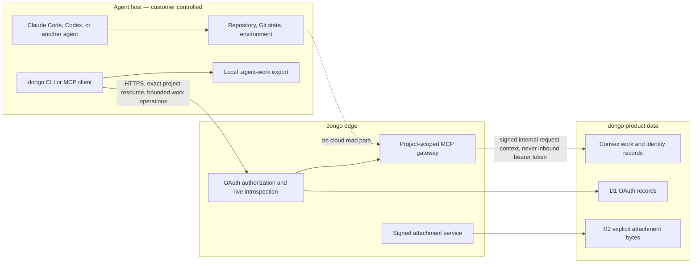

# Architecture and tenant isolation

Last reviewed: 2026-09-01

## Trust boundary

The local agent already has whatever repository access the user or agent host grants it. Connecting dongo does not broaden that local authority. It adds a bounded cloud API for work coordination.

## Public agent capability

The generated contract exposes exactly 18 operations:

- start a session and read bounded project context;
- read, claim, renew, and complete Intake triage;
- create, read, start, renew, update, and finish work;
- add attributed comments;
- request, read, and resolve human attention;
- request one explicitly referenced attachment; and
- read a deterministic export snapshot.

No operation accepts a shell command, repository path to read, Git ref, arbitrary URL to fetch, environment-variable name, or host filesystem path. `dongo_sync_snapshot` returns cloud work data; only the authorized local client can write `.agent-work`, and it does not stage, commit, or push.

## Authorization sequence

1. A human signs into dongo and approves one installation for one project.
2. The OAuth flow uses HTTPS and PKCE. The exact project MCP URL is the OAuth resource.
3. The authorization server creates a separate installation, agent actor, grant, scopes, and refresh-token family for that client.
4. Each MCP request presents its access token only to the MCP gateway.
5. The gateway performs live introspection and checks issuer, time bounds, exact audience, scopes, client, installation, grant, and project binding.
6. The gateway replaces the external credential with a signed, short-lived internal context before calling Convex. The external bearer token is never passed through.
7. Convex resolves the installation again, checks its active state and scopes, and authorizes the operation against the derived project. Callers cannot supply a trusted organization, project, actor, or installation ID.

Revocation changes the installation and binding state. Because the gateway does not keep a positive token cache, the next authenticated request is rejected after revocation.

## Tenant isolation

All project data is stored with server-derived organization and project identifiers. Human access is derived from the authenticated profile and membership. Agent access is derived from the verified installation binding. Cross-project identifiers return a not-found or forbidden result rather than changing the active project.

The OAuth resource itself includes the stable public project reference. A token issued for one project cannot be used against another project's MCP URL. CLI, Codex, Claude, generic MCP clients, and non-interactive service credentials have separate grants and agent identities.

## Attachments

Attachment upload is explicit and uses a short-lived, signed capability limited to one object key, MIME type, and maximum byte size. Finalization checks the observed size, MIME type, and optional SHA-256 checksum before the attachment becomes available.

Reads require the attachment to be finalized, the caller to be authorized for the same project, and the required attachment scope. The returned download URL expires after five minutes and maps to one object. R2 objects are private and served with `private, no-store` cache directives.

User-controlled filenames, comments, URLs, Intake, and attachment content are treated as untrusted data in the agent instructions. The service does not claim to malware-scan or content-inspect attachments today.

## Local CLI boundary

Interactive CLI credentials are stored in a dongo-owned user configuration directory outside every repository. POSIX directory and file permissions are `0700` and `0600`. Writes are atomic, and the CLI rejects unsafe owners, symlinks, non-regular files, loose permissions, and mismatched project or environment bindings.

The CLI does not invoke Keychain, Secret Service, a browser extension, a generic credential helper, or an installer in the normal flow. MCP hosts manage their own token storage. dongo writes URL-only MCP configuration and never copies the CLI credential into Codex, Claude, or another host.

## Environment boundary

Development and production use different public origins, Convex deployments, Workers, OAuth issuers, resource identifiers, secrets, R2 buckets, and email senders. Runtime checks require safe HTTPS endpoints and pinned issuers. Automated boundary tests prove that development credentials and project resources are rejected by production and vice versa.

## Operational telemetry

The MCP application's custom security events contain bounded metadata: operation, request ID, project ID, outcome, timing, cancellation state, and exception class. They do not contain tool arguments, tool results, work text, attachment content, access tokens, refresh tokens, or raw exception messages.

Cloudflare invocation logs and automatic traces separately capture provider-defined request and response metadata. Cloudflare documents a three-day retention window on Workers Free and seven days on Workers Paid, with a maximum of seven days. dongo does not export these logs to a separate long-term log store in the repository configuration.

## Threats and controls

| Threat | Current control |
| --- | --- |
| Token replay against another project | Exact resource/audience and project binding on every request. |
| Stolen or revoked refresh family remains usable | Live introspection and installation/binding status check; no positive cache. |
| MCP token reaches a downstream service | External bearer token is replaced by a signed internal context. |
| Agent impersonates the authorizing human | Every installation has its own agent actor and attribution. |
| Cross-tenant identifier probing | Server-derived principal plus organization/project checks on every record access. |
| Arbitrary repository or machine access | No shell, Git, repository-provider, filesystem, or arbitrary fetch operation in the cloud contract. |
| Credential committed to a repository | Owner-only local storage, non-secret repository marker, secret scanning, and token-redacting export. |
| Long-lived attachment URL leaks | Five-minute signed URL scoped to one finalized object; private/no-store responses. |
| Request payload leaks through custom logs | Bounded event schema and CI rejection of raw exception messages. |
| Development credential accepted in production | Separate issuers, resources, secrets, deployments, and automated boundary checks. |

